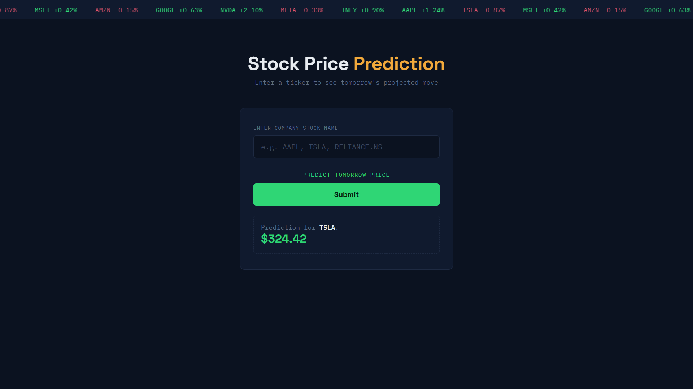
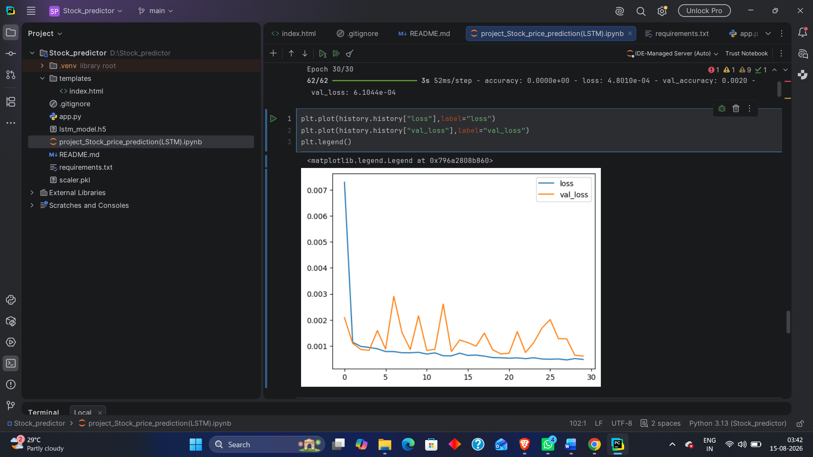
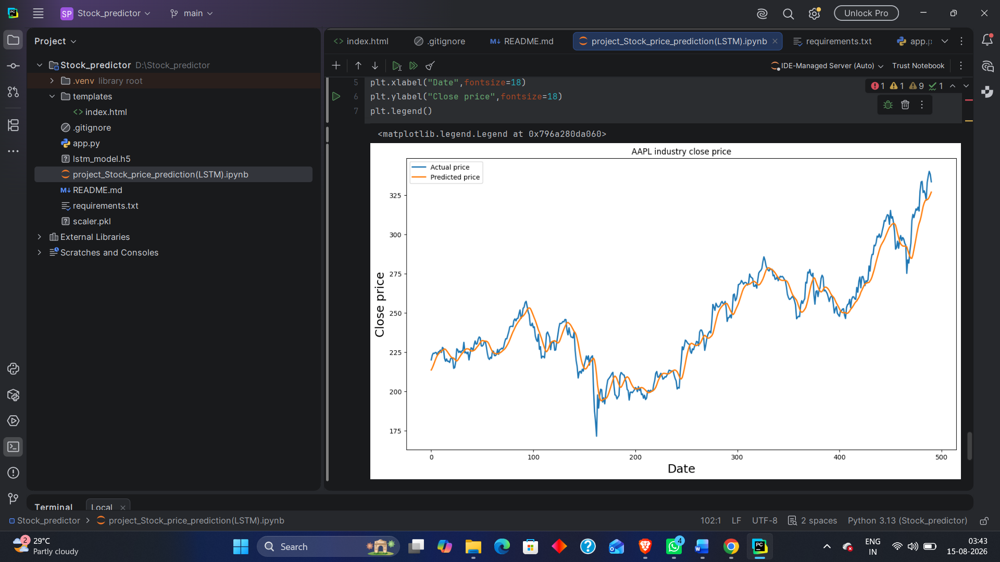
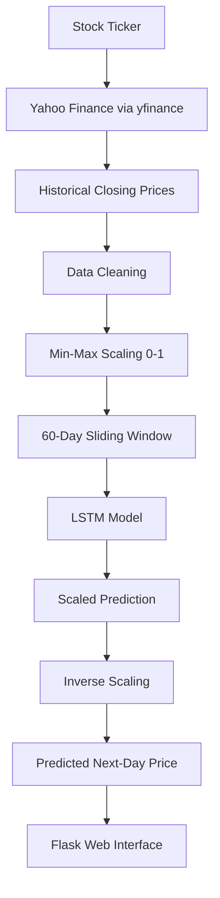

<div align="center">

# 📈 Stock Price Prediction using LSTM

**A deep learning web application that predicts next-day stock closing prices using a Long Short-Term Memory (LSTM) neural network.**


</div>

---

## 📌 Project Overview

This project predicts a stock's **next-day closing price** using a two-layer **LSTM (Long Short-Term Memory)** neural network trained on historical closing-price data.

LSTMs are well-suited to this task because closing prices form a **sequential time series** — each day's price is influenced by the pattern of preceding days. Unlike a standard feed-forward network, an LSTM retains memory of past time steps, allowing it to learn trends and short-term dependencies in the price series.

The project has two parts:

1. **Training (Jupyter Notebook)** — historical daily closing prices are downloaded, cleaned, scaled, and used to train an LSTM model. The trained model (`lstm_model.h5`) and the fitted scaler (`scaler.pkl`) are saved to disk.
2. **Inference (Flask Web App)** — `app.py` loads the **already-trained, fixed** model and scaler once at startup. When a user submits a ticker symbol, the app fetches the **most recent ~6 months of live data** from Yahoo Finance via `yfinance`, takes the last 60 closing prices, and feeds them through the pre-trained model to produce a prediction.

> **Important distinction:** the model's learned weights are **not** retrained per request. Only the *input data* is fetched live — this is what keeps predictions grounded in recent prices without needing to retrain the network every time.

---

## 🖥️ Demo / User Interface

### Web Interface
The web app presents a simple, dark-themed UI: the user enters a stock ticker (e.g. `AAPL`, `TSLA`, `RELIANCE.NS`) and clicks **Submit**. The predicted next-day closing price is then displayed on the page.



### Model Training
During training, the notebook plots training loss against validation loss over 30 epochs to visualize convergence and check for overfitting.



### Prediction Results
On the held-out test set, the notebook plots actual closing prices against the model's predictions to visually assess how well the model tracks real price movement.



---

## ✨ Key Features

- 🧠 **LSTM-based time-series forecasting** — a stacked LSTM network learns patterns from historical closing prices.
- 🔁 **60-day lookback window** — each prediction is based on the previous 60 trading days.
- 📏 **Min-Max normalization** — closing prices are scaled to `[0, 1]` before training/inference for stable LSTM performance.
- 🌐 **Live historical data retrieval** — training data is pulled directly from Yahoo Finance via `yfinance`.
- ⚡ **Live inference data** — the Flask app fetches recent (6-month) market data at prediction time, keeping inputs current.
- 💾 **Saved trained model** — `lstm_model.h5` stores the trained network so it doesn't need to be retrained for every prediction.
- 💾 **Saved fitted scaler** — `scaler.pkl` ensures inference-time scaling exactly matches training-time scaling.
- 🖥️ **Flask web interface** — a minimal form-based UI for entering a ticker and viewing the prediction.
- 📊 **Actual vs. predicted visualization** — the notebook plots model predictions against real prices on the test set.
- 📐 **RMSE-based evaluation** — model performance is quantified using Root Mean Squared Error.
- 🛡️ **Basic input validation & error handling** — the Flask route checks for empty tickers and insufficient data, and catches exceptions during prediction.

---

## 🔄 Machine Learning Pipeline



| Stage | Description |
|---|---|
| Stock Ticker | User-provided symbol (training: entered in notebook; inference: entered in web form) |
| Yahoo Finance / `yfinance` | Source of historical and recent daily OHLCV data |
| Historical Closing Prices | Only the `Close` column is used for modeling |
| Data Cleaning | Removing malformed header rows, indexing by date, type conversion |
| Min-Max Scaling | Normalizes prices to `[0, 1]` for stable LSTM training |
| 60-Day Sliding Window | Converts the price series into fixed-length input sequences |
| LSTM Model | Stacked LSTM network learns temporal patterns |
| Scaled Prediction → Inverse Scaling | Model output is transformed back to real price units |
| Flask Web Interface | Displays the final predicted price to the user |

---

## 🗂️ Dataset / Data Collection

Training data is collected directly in the notebook using `yfinance`:

```python
ticket = input("Enter the stock ticker symbol : ")
data = yf.download(ticket, period="10y", interval="1d")
data.to_csv(f"{ticket}.csv")
```

- **Period:** ~10 years of daily data
- **Initial columns:** full OHLCV (Open, High, Low, Close, Volume) data, as downloaded
- **Final modeling columns:** only `Date` and `Close` are retained after cleaning
- The notebook was experimented with using tickers such as **Tata Steel** and **AAPL** (visible in the plot titles and outputs) — the model is trained per-ticker on whatever symbol is entered, not on a universal multi-stock dataset.

At **inference time**, `app.py` fetches a much shorter, recent window instead of the full 10-year history:

```python
df = yf.download(ticker, period='6mo', progress=False)
```

This keeps the input to the model current without requiring the full historical dataset to be re-downloaded for every prediction.

---

## 🧹 Data Preprocessing

### Data Cleaning
The raw CSV downloaded via `yfinance` includes extra header rows from its multi-index column structure. The notebook cleans this up:

```python
df = df.iloc[2:, 0:2]                 # drop the extra header rows, keep first 2 columns
df = df.rename(columns={"Price": "Date"})
df["Date"] = pd.to_datetime(df["Date"])
df.set_index("Date", inplace=True)
df["Close"] = pd.to_numeric(df["Close"])
```

### Scaling
```python
scaler = MinMaxScaler(feature_range=(0, 1))
scaled_data = scaler.fit_transform(df)
```
Normalizing prices to a fixed `[0, 1]` range helps the LSTM train more stably and converge faster, since large, unscaled price values can otherwise dominate gradient updates.

### Sequence Creation
The model is trained on **60-day sliding windows**, where each sequence of 60 consecutive closing prices is used to predict the next day's price:

```text
Days 1–60   → predict Day 61
Days 2–61   → predict Day 62
Days 3–62   → predict Day 63
...
```

```python
def create_sequence(data, time_steps=60):
    X, Y = [], []
    for i in range(time_steps, len(data)):
        X.append(data[i - time_steps:i, 0])
        Y.append(data[i, 0])
    return np.array(X), np.array(Y)
```

---

## 🧠 LSTM Architecture

| Layer | Configuration | Output Shape | Parameters |
|---|---|---|---|
| LSTM | 50 units, `return_sequences=True` | `(None, 60, 50)` | 10,400 |
| Dropout | 20% | `(None, 60, 50)` | 0 |
| LSTM | 50 units | `(None, 50)` | 20,200 |
| Dropout | 20% | `(None, 50)` | 0 |
| Dense | 1 unit (output) | `(None, 1)` | 51 |

**Total params:** 30,651 (all trainable)

The input shape is `(60, 1)` — a sequence of 60 timesteps, each with a single feature (the scaled closing price). LSTMs are appropriate here because they maintain an internal memory state across timesteps, allowing the network to learn dependencies and trends across the 60-day window rather than treating each day independently.

```python
model = Sequential()
model.add(LSTM(units=50, return_sequences=True, input_shape=(X_train.shape[1], 1)))
model.add(Dropout(0.2))
model.add(LSTM(units=50, return_sequences=False))
model.add(Dropout(0.2))
model.add(Dense(units=1))
```

---

## ⚙️ Training Configuration

| Setting | Value |
|---|---|
| Optimizer | Adam |
| Loss function | Mean Squared Error |
| Epochs | 30 |
| Batch size | 32 |
| Train/test split | 80% / 20% |
| Split method | **Chronological** (not shuffled) — the last 20% of the time series is held out for testing |
| Validation data | Test split, evaluated after each epoch |

```python
model.compile(optimizer="adam", loss="mean_squared_error", metrics=["accuracy"])
history = model.fit(X_train, y_train, batch_size=32, epochs=30, validation_data=(X_test, y_test))
```

The split is done chronologically rather than randomly because this is a time-series forecasting problem — training on future data to predict the past would leak information and produce an unrealistically optimistic evaluation.

---

## 📊 Model Evaluation

```python
rmse = np.sqrt(mean_squared_error(y_test_actual, predictions))
```

**Test RMSE ≈ 7.8192** (on the original, un-scaled price)

RMSE (Root Mean Squared Error) measures the average magnitude of the difference between predicted and actual prices, in the same units as the stock price itself — so an RMSE of ~7.82 means predictions are, on average, off by roughly that many currency units.

> ⚠️ **Note on the `accuracy` metric:** `model.compile()` was configured with `metrics=["accuracy"]`, and this value appears in the training logs. This is a **regression problem** (predicting a continuous price), and Keras's classification-style `accuracy` metric is **not meaningful** in this context — it does not measure how close predictions are to actual prices. **RMSE is the correct metric to evaluate this model**, and is what this project uses for evaluation.

---

## 📈 Actual vs. Predicted Results

The notebook plots the model's predictions against the true closing prices on the held-out test set:


This graph shows that the model generally **tracks the overall trend and direction** of price movement. However, like most single-feature, closing-price-only LSTM models, it tends to **lag behind sharp, sudden price swings** rather than anticipating them — the prediction curve smooths out abrupt reversals more than the actual price does. This is a normal limitation of the approach, not a bug in the implementation.

---

## 🔮 Prediction Workflow in Flask

`app.py` performs the following steps for each prediction request:

1. Receives a stock ticker from the web form (`request.form.get('ticker')`)
2. Converts the ticker to uppercase and strips whitespace
3. Downloads the last ~6 months of data for that ticker via `yfinance`
4. Checks that enough data was returned (at least `LOOKBACK` = 60 rows); shows an error if not
5. Extracts the most recent 60 closing prices
6. Applies the **same fitted scaler** from training (`scaler.transform`, not `fit_transform`)
7. Reshapes the data into the LSTM's expected input shape `(1, 60, 1)`
8. Passes the sequence through the trained model (`model.predict`)
9. Inverse-transforms the scaled prediction back into real price units
10. Renders the result back to `index.html`, displaying the predicted price and ticker

```python
model = load_model('lstm_model.h5')
scaler = pickle.load(open('scaler.pkl', 'rb'))
```

The model and scaler are loaded **once, at application startup** — not on every request — so predictions are served efficiently without reloading the ~30K-parameter model each time.

---

## 🗃️ Project Structure

```text
Stock_predictor/
│
├── templates/
│   └── index.html                                 # Web UI: ticker form + prediction result
│
├── screenshots/                                    # UI and training/evaluation screenshots
│   ├── app-ui-prediction.png
│   ├── training-loss-curve.png
│   └── actual-vs-predicted.png
│
├── app.py                                          # Flask app — loads model/scaler, serves predictions
├── lstm_model.h5                                   # Trained LSTM model weights
├── scaler.pkl                                      # Fitted MinMaxScaler (must match training)
├── project_Stock_price_prediction(LSTM).ipynb      # Data collection, preprocessing, training, evaluation
├── requirements.txt                                # Python dependencies
├── README.md
└── .gitignore
```

---

## 🚀 Installation

### 1. Clone the repository
```bash
git clone <MY_REPOSITORY_URL>
cd Stock_predictor
```

### 2. Create a virtual environment

**Windows:**
```bash
python -m venv .venv
.venv\Scripts\activate
```

**Linux / macOS:**
```bash
python3 -m venv .venv
source .venv/bin/activate
```

### 3. Install dependencies
```bash
pip install -r requirements.txt
```

---

## ▶️ Running the Application

```bash
python app.py
```

This starts the Flask development server locally. Open the local address shown in the terminal (typically `http://127.0.0.1:5000`) in your browser to use the app.

---

## 🧭 How to Use

```text
Open application
      ↓
Enter stock ticker
      ↓
Click "Submit"
      ↓
Application downloads recent data
      ↓
Last 60 closing prices are selected
      ↓
Data is scaled
      ↓
LSTM generates prediction
      ↓
Prediction is converted back to price scale
      ↓
Predicted price is displayed
```

Example tickers to try:
```text
AAPL
TSLA
MSFT
RELIANCE.NS
```

Valid ticker symbols depend entirely on what `yfinance` / Yahoo Finance recognizes — invalid or delisted symbols will return an error in the UI.

---

## 💾 Saved Model Artifacts

**`lstm_model.h5`**
The trained LSTM model, saved after training in the notebook. Loaded by `app.py` for inference so the network doesn't need to be retrained on every request.

**`scaler.pkl`**
The `MinMaxScaler` instance **fitted on the training data**, saved via `pickle`. It's critical that inference uses this exact same fitted scaler (`scaler.transform`) rather than a newly fitted one — using a different scaler would map prices to a different numeric range than the model was trained on, producing incorrect predictions.

---

## 🛠️ Technologies Used

| Technology | Purpose |
|---|---|
| Python | Core programming language |
| TensorFlow / Keras | Building and training the LSTM model |
| Flask | Serving the web application and prediction endpoint |
| yfinance | Fetching historical and live stock market data |
| Pandas | Data loading, cleaning, and manipulation |
| NumPy | Array operations and sequence construction |
| scikit-learn | `MinMaxScaler` and RMSE calculation |
| Matplotlib | Visualizing training loss and prediction results *(used in the notebook; not required to run the Flask app, so it is not listed in `requirements.txt`)* |

---

## ⚠️ Limitations

- Stock prices are highly volatile and influenced by many factors beyond historical price patterns.
- The model uses only historical **closing prices** — it does not incorporate news, earnings, macroeconomic data, or market sentiment.
- Sudden, event-driven price movements (e.g. earnings surprises, breaking news) are not something a price-history-only model can anticipate.
- Model performance (RMSE) was evaluated on a specific ticker's historical data and may vary significantly for other stocks or time periods.
- The deployed model is a **fixed, pre-trained** model — the Flask app performs inference only and does not retrain or fine-tune itself on new data.
- Predictions should **not** be treated as financial advice or a guarantee of future price movement.

---

## 🔭 Future Improvements

*The following are potential directions for extending this project — they are not currently implemented.*

- Add technical indicators (RSI, MACD, moving averages) as additional model features
- Incorporate Open/High/Low/Volume data instead of Close price alone
- Compare LSTM performance against GRU, Transformer, or XGBoost-based approaches
- Add a model retraining/update pipeline
- Add interactive, zoomable price charts in the web UI
- Add prediction confidence intervals or uncertainty estimates
- Track and display historical prediction accuracy over time
- Use walk-forward / time-series cross-validation for more robust evaluation
- Add automated monitoring for model drift
- Deploy the application to a cloud hosting platform

---

## 📢 Responsible Use / Disclaimer

This project is for **educational and experimental purposes only**. Stock-market predictions are inherently uncertain, and the outputs of this model should **not** be considered financial advice or a guarantee of future prices. Always do your own research and consult a qualified financial advisor before making investment decisions.

---

## 👤 Author

**[ Abhishek Kumar ]**
Data Science / Machine Learning Enthusiast — Final-year B.Tech (CS, Data Science)

---

## 📄 License

MIT
